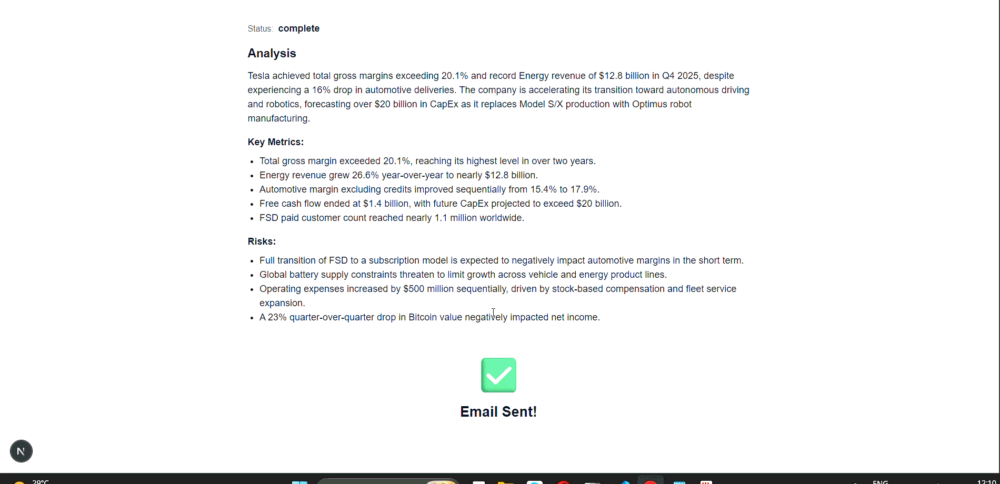

# 🤖 Business Analyst Agent

<p align="center">
  <strong>Research anything. Get analysis. Approve. Send. Done.</strong><br/>
  An autonomous AI workflow that searches the web, analyzes reports, drafts a professional email, waits for your approval — then sends it.
</p>

<p align="center">


</p>

---

## ✨ Demo

> 🎬 **Watch it in action** — query → research → analysis → draft → approve → email delivered.



<p align="center">
  <em>⬆️ Type a query, enter your email, hit <strong>Start Research</strong>, review the draft, hit <strong>Approve & Send</strong>.</em>
</p>

> 📌 **GIF note:** this demos from `./public/EmailSentGif.gif`. To swap it, just replace that file (keep the name) or update the path above. Keep GIFs under ~5 MB so they load fast on GitHub.

---

## 🚀 What it does

| Step | What happens |
|------|--------------|
| 🔍 **Research** | Searches the live web with [Tavily](https://tavily.com), then scrapes the full report with [Firecrawl](https://firecrawl.dev) |
| 📊 **Analyze** | [Gemini](https://ai.google.dev/) extracts summary, key metrics, risks & opportunities as structured JSON |
| ✉️ **Draft** | Gemini writes a clean, plain-text professional email with a proper subject line |
| 🧑‍💼 **Approve** | The workflow **pauses** and shows you the draft — nothing sends without your click |
| 📨 **Send** | On approval, sends via [Resend](https://resend.com) with Gmail-safe HTML formatting |

```
Query ──► Research ──► Analyze ──► Draft ──► ⏸ Awaiting Approval ──► ✅ Send
```

---

## 🧠 Architecture

```
Next.js UI (page.tsx) ──POST──► /api/agent/route.ts
     │ initial run                    │ approved=true
     ▼                                ▼
 LangGraph: research → analyze → draft → END     sendNode() only (no re-research)
     │                                                  │
     ▼                                                  ▼
 ⏸ awaiting_approval (draft shown in UI)          📨 Resend
```

| File | Role |
|------|------|
| `app/page.tsx` | UI — query + email form, draft preview, approve/cancel |
| `app/api/agent/route.ts` | API — runs graph first, runs only `sendNode` on approval |
| `lib/agent/graph.ts` | LangGraph wiring + routing (pauses at `awaiting_approval`) |
| `lib/agent/nodes.ts` | The 4 nodes: research, analyze, draft, send (+ Gemini fallback chain) |
| `lib/services/research.ts` | Tavily search + Firecrawl scrape (lazy clients) |
| `lib/services/email.ts` | Resend sender + plain-text → email-safe HTML |

---

## 🛠️ Tech stack

- **Framework:** Next.js 16 (App Router) + React 19 + TypeScript
- **Agent:** LangGraph + LangChain (`@langchain/langgraph`, `@langchain/google-genai`)
- **LLM:** Google Gemini (automatic model fallback chain)
- **Search:** Tavily API · **Scrape:** Firecrawl · **Email:** Resend · **Styling:** Tailwind CSS 4

---

## ⚡ Quickstart

### 1. Prerequisites

### 1. Prerequisites

- Node.js 18+ and npm
- API keys: [Gemini](https://aistudio.google.com/app/apikey) · [Tavily](https://tavily.com) · [Firecrawl](https://www.firecrawl.dev) · [Resend](https://resend.com/api-keys)

### 2. Install

```bash
git clone https://github.com/<you>/business-analyst-agent.git
cd business-analyst-agent
npm install
```

### 3. Configure env

Create `.env.local` in the project root:

```env
GOOGLE_API_KEY=your_gemini_key
# optional: GOOGLE_MODEL=gemini-3.6-flash

TAVILY_API_KEY=your_tavily_key
FIRECRAWL_API_KEY=your_firecrawl_key

RESEND_API_KEY=your_resend_key
RECIPIENT_EMAIL=delivered@resend.dev
```

> ⚠️ **Resend test mode:** `from: onboarding@resend.dev` can only deliver to your account email or `delivered@resend.dev`. To email anyone else, [verify a domain](https://resend.com/domains) and change `from` in `lib/services/email.ts`.

### 4. Run

```bash
npm run dev
```

Open [http://localhost:3000](http://localhost:3000) → type e.g. `Tesla latest quarterly earnings report` → enter your email → **Start Research** → review → **Approve & Send** ✅

---

## 💡 Example

**Query:** *Research Tesla's Q4 earnings, analyze the risks, and email me a summary.*

**You get:**

> **Subject:** Tesla Q4 2025 Earnings: Record Energy Revenue Amid Strategic Pivot
>
> Dear Team,
>
> Please find below a summary of Tesla's Q4 2025 financial performance…
>
> Total gross margin exceeded 20.1%…
> Energy revenue rose 26.6% to a record $12.8B…
>
> Best regards, …

---

## 🔧 Configuration

| Env var | Required | What it does |
|---------|----------|--------------|
| `GOOGLE_API_KEY` (or `GOOGLE_GENERATIVE_AI_API_KEY`) | ✅ | Gemini LLM calls |
| `GOOGLE_MODEL` / `GOOGLE_GENAI_MODEL` | ❌ | Override primary model (default `gemini-3.6-flash`, falls back to `gemini-2.5-flash` → `gemini-1.5-flash`) |
| `TAVILY_API_KEY` | ✅ | Web search |
| `FIRECRAWL_API_KEY` | ✅ | Full-page scraping |
| `RESEND_API_KEY` | ✅ | Sending email |
| `RECIPIENT_EMAIL` | ❌ | Fallback recipient if UI sends none |

---

## 🐛 Troubleshooting

| Symptom | Fix |
|---------|-----|
| `gemini-X is no longer available (404)` | Set `GOOGLE_MODEL=gemini-3.6-flash` in `.env.local` and **restart** `next dev` |
| `Resend rejected the email` | Test mode — send to your own account email or `delivered@resend.dev`, or verify a domain |
| `Missing … env var` | You need `.env.local` (not `.env`) + restart dev server after any env change |
| Button stays disabled | Enter a query + valid email; hover the button for the reason |
| Washed-out / invisible text | Fixed — light-only UI. Hard-refresh with `Ctrl+Shift+R` |
| Email body shows `**` / `###` | Fixed — plain-text prompt + HTML conversion. Only affects **new** runs |

---

## 🗺️ Roadmap

- [ ] Editable draft before sending
- [ ] Streaming status updates (research → analyzing → drafting…)
- [ ] Multi-recipient + CC support
- [ ] Scheduled / recurring reports
- [ ] PDF attachment of full analysis
- [ ] Custom verified-domain `from` picker

---

## 🤝 Contributing

PRs welcome!

1. Fork → branch (`feat/my-thing`) → PR
2. Keep `npx tsc --noEmit` green
3. Match existing style (light-only UI, lazy API clients, explicit errors)

---

## 📄 License

MIT — do whatever you want, just don't blame me when the robot emails your boss. 🤖

---

<p align="center">
  Built with 💙 using Next.js · LangGraph · Gemini · Tavily · Firecrawl · Resend
</p>

